# Neural Networks and Deep Learning

## Week 1: Introduction

### What is a Neural Network? (NN)
Let’s consider the housing price prediction problem: we want to predict the price of a house given its size. We may fit a straight line, but we also want the price of the house to never be negative. To avoid this, let’s bend the curve so that it becomes horizontal once it reaches zero.

We can think of this a small neural network with a single neuron, that given the price outputs either zero or a value based on the line’s slope and the house size. In the neural networks literature, this is called a *Re*ctified *L*inear *U*nit, or *ReLU* .

Let’s assume we know more things about the house, for instance number of bedrooms, postal code, wealth of the country, etc. Each of these things would imply other informations (like size of the family that can fit in, walkability, school quality in the neighbourhood, etc.). Those factors, then, influence the price. What we’re describing is a neural networks that takes certain features (size, n of bedrooms, etc), and can combine them into more abstract features (we can think of them as the walkability, school quality, etc that we talked about before) in order to better predict the price.

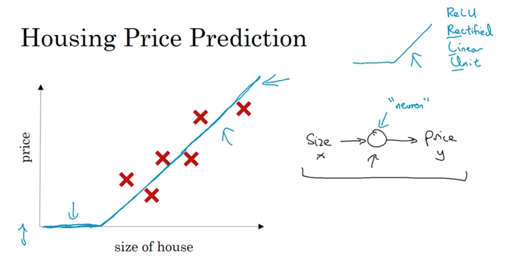

This nodes that placed between the input features and the output are called _hidden nodes_, and since each of them is connected to every input feature the NN is called _fully connected_.

### Supervised Learning
The most value in DL is in *Supervised Learning* applications: you have an input X, and you want to predict the output Y. For instance:

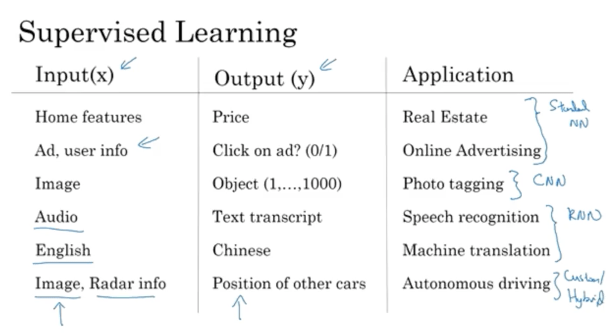


Different types of Neural Networks are used for different kinds of input data. For instance for Real Estate and Online Advertising standard NNs work well, while for photo tagging Convolutional Neural Networks (CNNs) are the best, for sequence data Recurrent Neural Networks (RNNs) are used instead. For more complicated situations custom implementations are used.

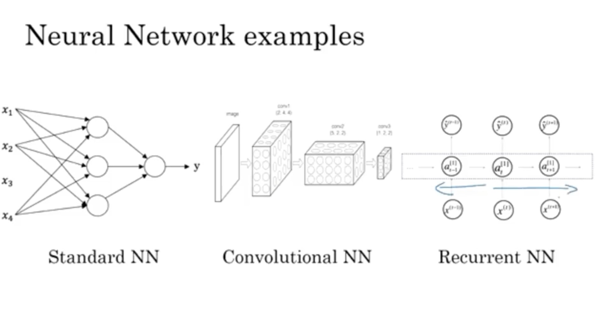

Supervised Learning has been used both with _Structured Data_ (classic RMBS database for instance) and with _Unstructured Data_, like text, audio and images, where each feature (for instance a pixel in an image) doesn’t have a precise meaning by itself. DL greatly improved our capabilities of mailing sense of Unstructured Data. Those application made more “noise” in the media, but the economic implications of DL has been great on both uses.

### Why is Deep Learning taking off?
The traditional learning algorithms (SVMs, logistic regression, etc.) have performances often plateau with increasing amount of data. In recent times with the digitalisation of the society we’re starting to have massive amounts of data. With scale, bigger NNs start performing significantly better. Therefore, **scale** is what is driving deep learning progress.

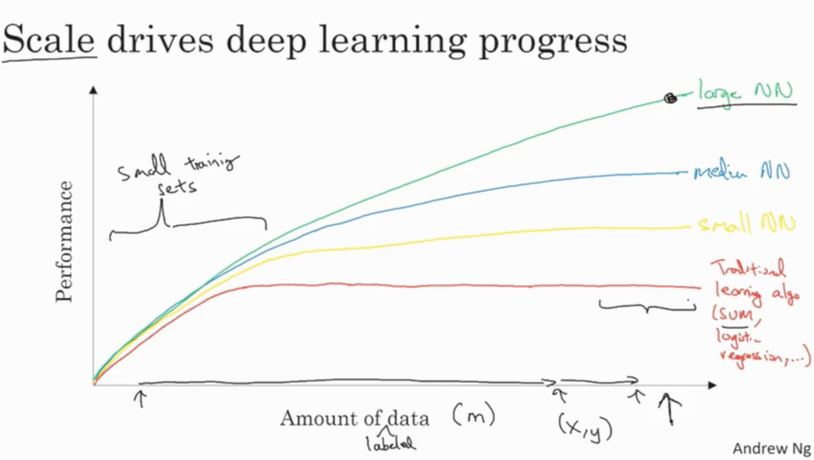

With small training sets, the performances of the system are often driven by the skill of the person training the dataset in training the hyperparameters, engineering features, choosing the algorithm and so on. With very large datasets, Deep NNs are the best option compared to the aforementioned strategies.

In the modern rise of DL, the first approach was to scale data and computational power. In the last years, the focus switched on improving the algorithms instead. For instance, a breakthrough was to switch from sigmoid activation functions to ReLUs, that avoid having very small gradients at the extremes of the function and therefore very slow learning. This approach therefore greatly speeded up computation. 

This is very important also because the approach for creating new ML applications is iterative: you start from an idea, code it, experiment, and iterate. With slow computation, this cycle is very slow, while faster computation allowed to iterate much faster and test more ideas.

## Week 2: Basics of NN programming
### Binary classification:
In binary classification the goal is, given an input, predict to which of two classes this input belongs to. For instance, given the picture of a cat we want to classify it between cat (1) or not cat (0). In this case, if we have an RGB image which is 64 pixels by 64, we can represent it as a $64*64*3 = 12288 $ vector (3 because of the three channels R, G, and B for red, green and blue). We’ll use $n_x$ to indicate the number of features of the input (in this case 12288).

Other notations useful for the course:
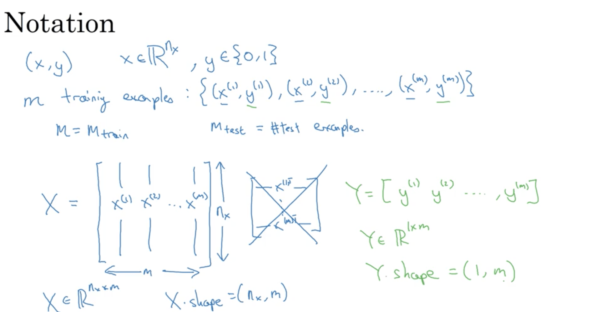

### Logistic regression
What we want is: given an input $x$, we want a prediction of the probability that the class is either one or zero given $\widehat{y} = P(y=1 | x), x \in R^{n_x}$. 

The parameters are the weights and biases $w \in R^{n_x}, b \in R$. If the output is a simple linear function 

$$ \widehat{y} = w^T x + b $$

it won’t make much sense, since it would imply that the probability may be much higher or much lower than zero (it’s a linear function). Since the probability has to be between zero and one, we’ll use as an output the sigmoid of that linear function:

$$ \widehat{y} = \sigma(w^T x + b) $$

Where

$$ \sigma(z) = \frac{1}{1+e^{-z}}$$

This function would allow use to have a probability very close to 1 if the linear function outputs a very large value, or close to zero if it outputs a high negative value.

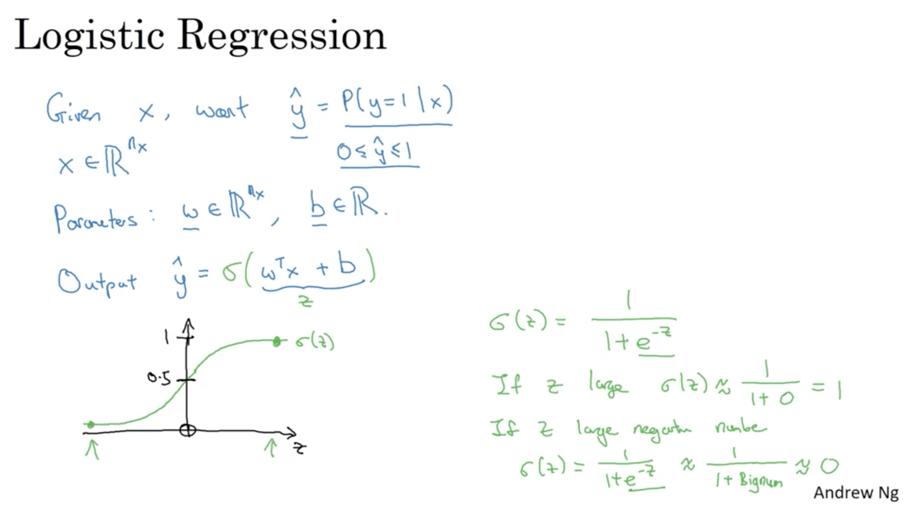

### Logistic regression cost function
For each training example $(x^{(i)}, y^{(i)})$, we want to compute $$ \widehat{y} = \sigma(w^T x + b) $$ so that $\widehat{y} \approx y^{(i)}$.

We need to compute the error of our model. Traditionally, the most used loss function would be:

$$ L(\widehat{y}, y) = \frac{1}{2} (\widehat{y} - y)^2 $$

However, this function may not be convex, making us get stuck in local minima. For this reason, our loss function is going to be instead:

$$ L(\widehat{y}, y) = - (y \log \widehat{y} + (1-y) \log (1 - \widehat{y}) ) $$

To have an intuition on why it makes sense, let’s consider the two cases:

1. $y=1$: in this case the loss becomes simply $-\log \widehat{y} $. Since we want the loss function to be small, then we want $\widehat{y}$ to be very large.
2. $y=0$: in this case the loss becomes simply $-  \log (1- \widehat{y}) $. Since we want the loss function to be small, then we want $ \log( 1- \widehat{y} ) $ to be very large, and therefore $ \widehat{y} $ to be very small.

The total loss function would be:

$$ J(w, b) = \frac{1}{m} \sum^{m}_{i=1} L(\widehat{y}^{(i)}, y^{(i)}) $$

This is going to be referred to as _cost_ function, whereas the _loss_ function it’s referred to the single example. Our goal is then to find $(w, b)$ that minimise $J$.

### Gradient Descent
The cost function is convex: we can find its global minimum. What Gradient Descent does is, initialising w and b from all zeros or from random values, starts from this initial value for J and makes step in the direction of the biggest gradient (steepest direction in the curve), until converging to the global optimum (or close by).

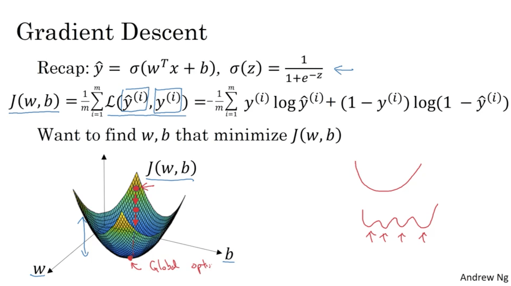

For the purpose of clarity, let’s consider a function $J(w)$. Gradient descent does the following:


\begin{align}
 & Repeat \{ \\
 & w := w- alpha * dJ(w) / dw \\
 & \} \\ 
\end{align}

While we write code, we’ll just write

```
w = w- \alpha dw
```

The gradient’s meaning is the slope of the curve. Therefore assuming that we’re starting from the right side of the curve in the next picture, its gradient it’s going to be positive (slope > 0), therefore the gradient descent  step is going to move our point in the opposite direction of the slope, which is towards the center, where the minimum is. The same applies if we start with a J that is in the left side of the curve (slope < 0 -> step in the opposite direction, towards the center).

This works in case J is just a function of w ($J = J(w)$). What if J depends also on b? ($ J = J(w, b) $).
Then we have two updates:

$$
w:= w- \alpha \frac{\delta J(w, b)}{dw} \\
b:= b- \alpha \frac{\delta J(w, b)}{db}
$$

Where we’re using the symbol $\delta$ because J is a function of two variables and therefore we use the symbol for the partial derivative.
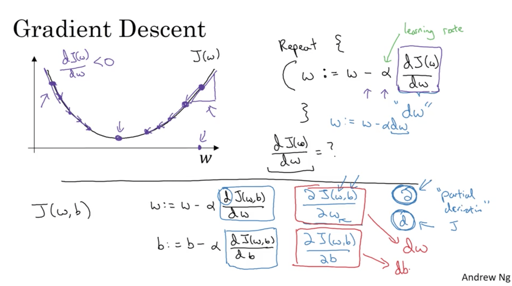

### Derivatives
Let’s take a function $f(a) = 3a$. If we take a point with a coordinate 2, its value on the vertical axis is going to be $f(2) = 3*2 = 6$ If we move a little further on the right, let’s say to $a = 2*0.001$, we’ll have a value of $f(2 * 0.001) = 6*003$. The slope of the function is the ratio between the height and the width we moved, so in this case $0.003/0.001 = 3$. If we take $a = 5$, $(f(a) = 15)$ and calculate the value for $a = 5 * 0.001$, we’ll get the same thing: $f(5*0.001) = 15*003$. The slope is the same in this case

The formal definition for a derivative is like making this process with an infinitesimal step $\epsilon$.


What if we have a function that has a different shape, for instance a parabolic function $f(a) = a^2$?. If $a = 2$, $f(a) = 4$.
If $a = 2.001$, then $f(a) \approx 4*004$. This means that the derivative of $f$ at $a=2$ is $4$, which means that every step we do horizontally is going to cause a variation vertically 4 times higher.

If we take $a = 5$, $f(a) = 25$. If $a = 5*0.001$, $f(a)\approx 25*0.01$. Therefore, the derivative of f at $a=5$ is 10. In this case, the derivative of the function is 2a.

One way to see this phenomenon is to look at the shape of the triangles we’d draw and thing about the height/width ratio. 
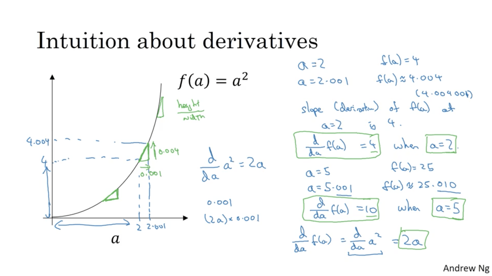

More examples:

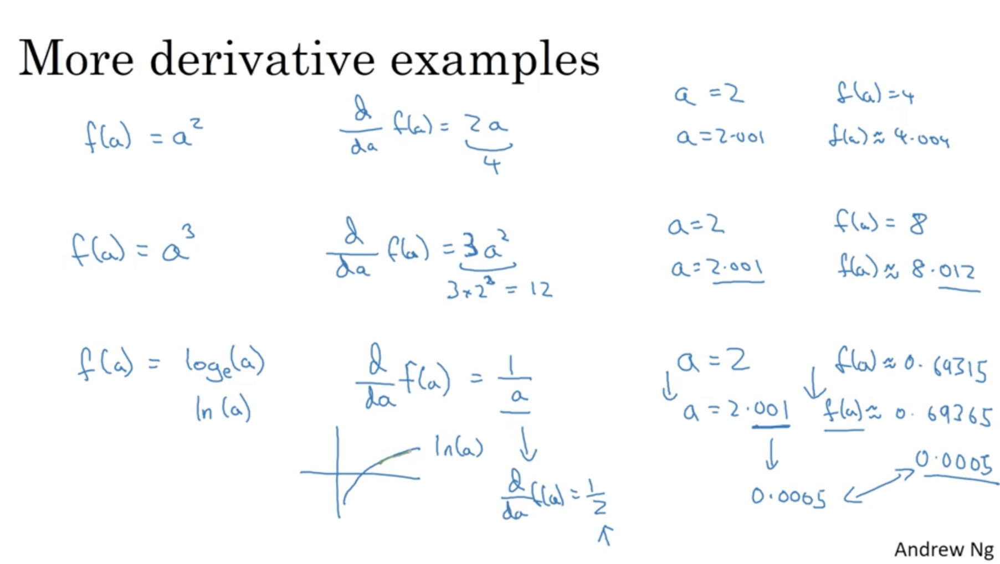

### Computation graph
We can see the computations of a neural network as divided in two parts: a forward path or _forward propagation_ in which we compute the output of the network, and a backward path or _back propagation_ in which we compute derivatives. The _computation graph_ explains why it’s organised this way.

Let’s consider a cost function

$$ J(a, b, c) = 3(a+bc)  $$

We can consider this function as made of three computations:
1. u = b*c
2. v = a + u
3. j = 3*v

We can consider those three operations in a computational graph this way:
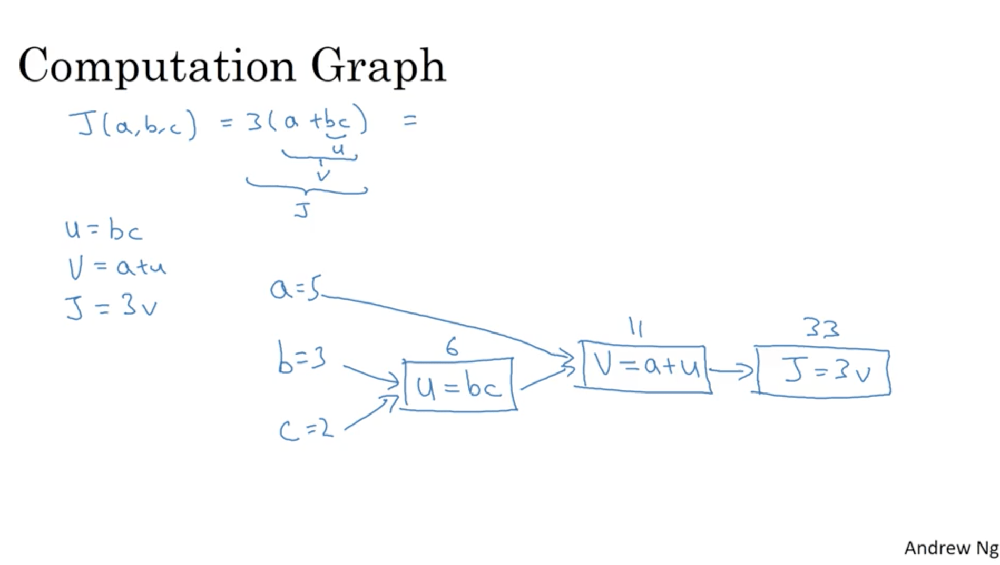


### Derivatives with a Computation Graph
Let’s see how to calculate derivatives in a computation graph.

When you have a function (J in this case) which depends from a series of different variables (a, b, c, v in the old case), in calculus there’s something called the _”chain rule”_, which says that if J is a function of v, which is a function of a and u, the amount of which J changes if you nudge a is the product of the change of v nudging a times how much J changes nudging v.

In math terms:
$$
\frac{dJ}{da} = \frac{dJ}{dv} \frac{dv}{da}
$$

This process can be done starting from the last node in the computation graph, going backwards until we compute all the partial derivatives.

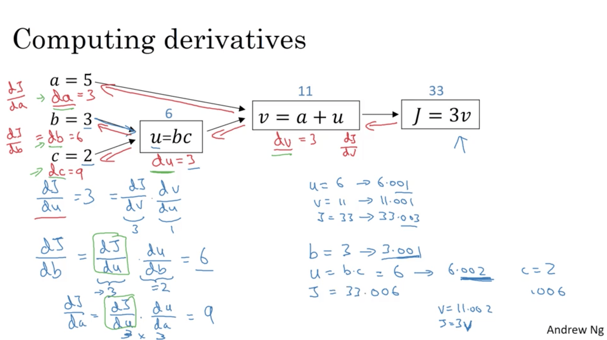

For the coding convention we’ll be using, we’ll call `dvar` the derivative of J with respect to `var` ($dJ/dvar$).

### Logistic Regression Gradient Descent
To recap:
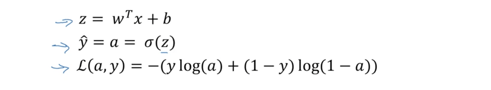

This can be drawn as a computation graph this way:

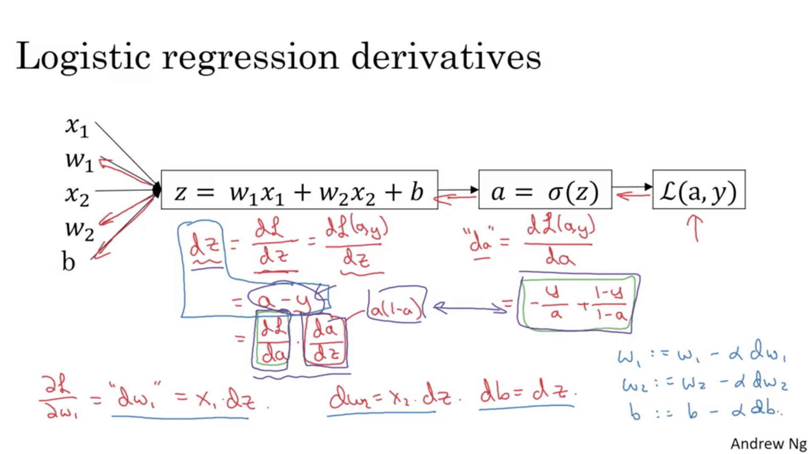

### Gradient Descent on m Examples
With m examples, we’d have

$$ J(w, b) = \frac{1}{m} \sum^{m}_{i=1} L(\widehat{y}^{(i)}, y^{(i)}) $$

It turns out that the derivative of the loss with respect to a certain weight $w_1$ for all the examples is going to be simply the average of the derivative of the cost for each variable with respect to a certain weight $w_1$.

$$ J(w, b) = \frac{1}{m} \sum^{m}_{i=1} \frac{d}{dw_i}L(a^{(i)}, y^{(i)}) $$


Let’s formalise all this in a concrete algorithm. We’ll write that in pseudo-python:

```
J = 0
dw1 = 0
dw2 = 0 #let's assume just two weights
db = 0

for i in range(0, m):
    z[i] = transpose(w) * x[i] + b
    a[i] = sigmoid(z[i])
    J += -( y[i] log(a[i]) +  (1 - y[i]) * log(1-a[i])
    dz[i] = a[i] - y[i]
    #we assume we have just two variables.
    #for n features this would become another for loop
    dw1 += x1[i] * dz[i] 
    dw2 += x2[i] * dz[i]
    db += dz[i]

J /= m
dw1 /= m
dw2 /= m
db /= m

w1 = w1 - alpha * dw1
w2 = w2 - alpha * dw2
b = b - alpha * db
```

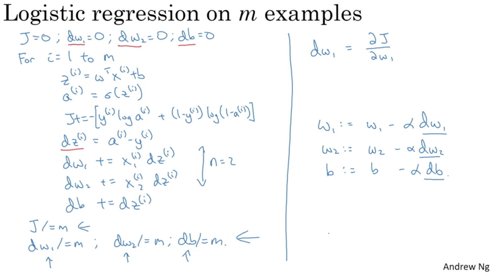


In this case you have to implement two for loops: one for each training example and one for each feature.
This process would make everything very slow with big datasets, therefore we start using vectorization, which is a technique that allows us to avoid for loops, using just vectors.

### Vectorization
Let’s assume we want to compute $z=w^T x + b$, where w and x  are vectors belonging to $R^{n_x}$.

In python the non-vectorized implementation would be something like:
```
z = 0
for i in range(n_x):
    z += w[i] * x[i]
z += b
```

The vectorized implementation using the numpy library would be instead:
```
import numpy as np #from now on we'll avoid writing this line and assume numpy was imported as np

z = np.dot(w, x) + b
```

This is not just easier to write, it’s also much faster: making a test with two vectors made of 1 million random values, the non-vectorized version is almost 300 times slower than the vectorized one!

Moreover, both with CPUs and GPUs it’s possible to take advantage of parallelised computation using libraries such as numpy.

The role of thumb therefore is: _don’t_ use explicit for loops when it’s possible.

Let’s make another example with matrices. Let’s say we have to sum a matrix A with a vector v: $u = A*v$. The definition of matrix multiplication would be:

$$ 
u = Av
u_i = \sum_{i} \sum_{j} A_{ij}v{_j}
$$

The python implementation with a for loop would be instead:
```
u = np.zeros((n, 1))
for i ...:
   for j ...:
       u[i] 0 A[i][j] * v[j]
```

Vectorized implementation:
```
u = np.dot(A, v)
```

This avoids two for loops and it’s therefore way faster.

Vectorization is useful not also for matrix multiplications, but also for other operations. Let’s say for instance that I have a vector v, and I want to compute the element-wise exponential of this value. The non-vectorized implementation would be:

```
u = np.zeros((n, 1))
for i in range(n):
    u[i] = math.exp(v[i])
```

Whereas the vectorized implementation would be:
```
u = np.exp(v)
```

The numpy has many other vector functions, such as:
```
np.log(v) #element-wise logarithm
np.abs(v) #element-wise absolute value
np.maximum(v, 0) #element-wise maximum between the element and 0
v**2 #element-wise squared
```

Let’s now take everything we learned and try to write a vectorized implementation of our logistic regression with Gradient Descent.

We’ll start by initialising the weights as a vector instead of single values:
```
dw = np.zeros((nx, i))
```

We’ll now transform the weights adjustments this way:
```
for i in range(n):
    dw += x[i] * dz[i]
    dw /= m
```

We now just have a for loop over the training examples.

### Vectorizing Logistic Regression
We can think of a matrix X made of the n training examples stacked together as columns. X would therefore have a $(n_x, m)$ shape.

Our predictions would then be a m-dimensional vector, which can be obtained in the following way:

$$
[z^{(1)}, z^{(2)}, \ldots ,z^{(m)}] = w^T X + [b, b, \ldots, b]
$$

The product $w^T X $ would be a row vector with for each element the product $w^T x^{(i)}$. This would be $z^{(i)}$, and we can therefore call Z the vector of the stacked values $z^{(i)}$.

In numpy, all this would simply be:
```
Z = np.dot(w.T, x) + b 
#nb: even if b is a single value, python will automatically turn into a m-dimensional vector
```

This operation is called _“broadcasting”_ in python.

Now we just have to calculate $A = \sigma(Z) $.

### Vectorizing Logistic Regression's Gradient Output
Previously, we computed the derivatives for each training example’s prediction as $dz^{(1)} = a^{(1)}  - y^{(1)} $, $dz^{(2)} = a^{(2)}  - y^{(2)}$ and so on.

We can think of a m-dimensional row vector $dZ = [dz^{(1)} ,dz^{(2)}, \ldots , dz^{(m)} ]$. Remember how we defined $A = [a^{(1)} ,a^{(2)}, \ldots , a^{(m)} ]$ and $Y = [y^{(1)} ,y^{(2)}, \ldots , y^{(m)} ]$.

Therefore, we can compute dZ in one line of code as $dZ = A - Y = [a^{(1)}  - y^{(1)} , a^{(2)} - y^{(2)} , \ldots , a^{(m)} - y^{(m)}  ]$.

In the previous implementation we still had a for loop over the training examples to calculate the derivatives. Now we can write:

```
db = 1 / m * np.sum(dZ)
dw = 1 / m * X * dz.T
```

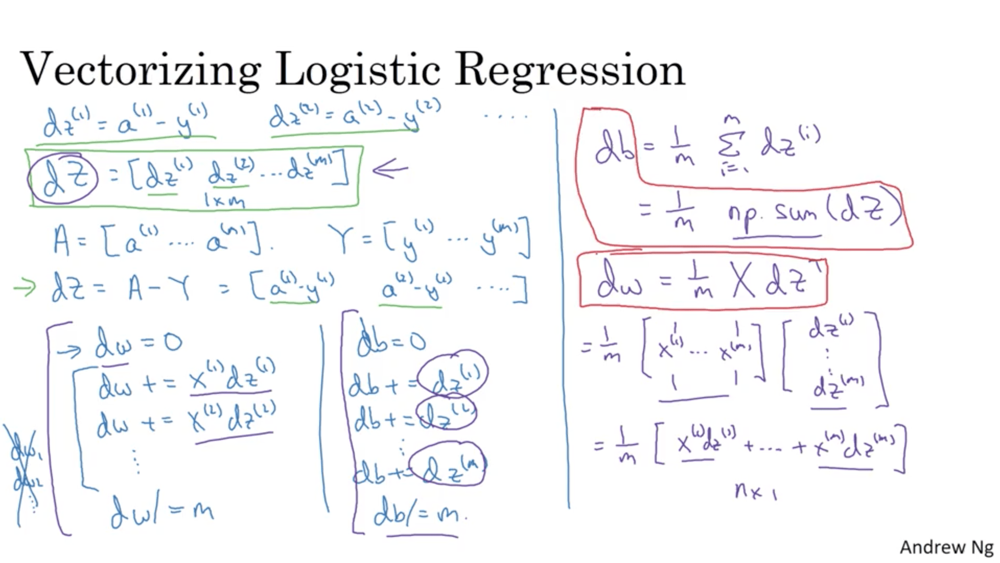


Put all together it becomes:

```
Z = np.dot(w.T, X) + b
A = sigmoid(Z)
dZ = A - Y
dw = 1 / m * X * dz.T
db = 1/m * np.sum(dZ)

w = w - alpha * dw
b = b - alpha * db
```

This version has no for loop and is much faster than the original one. If we want to iterate this for a certain number of time, we still need a for loop that executes the code wrote before the number of times we want.

### Broadcasting
Broadcasting is a technique that can be used to speed up computation.

Let’s say we have a matrix A which has different foods on the columns and their content of carbs, proteins and fat on the rows:
IMAGE

We want to get a matrix with the percentages of nutrients in each food. This should be done by summing over the columns and then dividing the each value of a column for this sum. If we want to do that without for loops, we can use the python broadcasting technique:

```
A = ... #a 3X4 matrix, 4 foods and 3 nutrients
cal = A.sum(axis=0) #sum the rows column by column
percentage = 100 * A / cal.reshape(1, 4)
```

What we did was dividing a 3 by 4 matrix for a 1 by 4 vector. Notice that the command `.reshape(1, 4)` wasn’t necessary since cal is already a 1 by 4 row, but this can be done anyhow to be certain about the dimension of the vectors we’re multiplying together.

How did python do that? Let’s say that we do this:
```
a = [1, 2, 3, 4]
b = a + 100
```

What python does is transforming automatically b in a vector, so that what is doing is adding a to `[100, 100, 100]`. What happened before is the same thing, but with another dimension. As an example:

```
a = [[1, 2, 3],
     [4, 5, 6]]
b = [100, 200, 300]
c = a + b
```

You would get in the end:

```
c = [[100, 202, 303],
     [404, 505, 606]]
```

What python does in this case is transforming b into:

```
b = [[100, 200, 300],
     [100, 200, 300]]
```

This works also for column vectors:

```
a = [[1, 2, 3],
     [4, 5, 6]]
b = [[100],
     [200]]
c = a + b
```

Python transforms b into:

```
b = [[100, 100, 100],
     [200, 200, 200]]
```

And you end up with:

```
c = [[101, 102, 103],
     [204, 205, 206]]
```

The general principle of broadcasting in python is that if I have a m by n matrix and I sum, subtract, multiply or divide by a 1 by n or m by 1 matrix, it would transform the latter into a m by n matrix.

This works also for a m by 1 vector to which I want to sum, subtract, multiply or divide a scalar value, it would transform the latter into a m by 1 vector.

### A note on python/numpy vectors
Having this implicit transformations has positive and negative sides. It’s good since you can have an expressive way of writing matrix operations, as well as be fast in implementing them. On the other hand, it makes possible to have bug that are hard to identify.

Let’s see some problems you may often see:
```
import numpy as np

#vector with 5 gaussian distributed random numbers
a = np.random.randn(5) 

print(a.shape)
Out: (5,)
```

This is called a _rank-1 array_, which is neither a column nor a row vector. In fact, if we do:

```
(a.T == a).all()
Out: True
```

Also, if we do 
```
print(np.dot(a, a.T))
Out: 1,135 #we get a number!
```

The best thing to do to avoid this is then to write:
```
a = np.random.rand(5,1)
```

This would give us a column vector instead, as expected. In this case, the following returns the alter product as expected.

```
np.dot(a, a.T)
```

So the rule is to always declare vectors as column or row vectors and never use rank-1 arrays, like this:

```
column_vector = np.random.randn(5, 1)
row_vector = np.random.randn(1, 5)
dont_use = np.random.randn(5)
```

A test that can be done to make sure we’re using variables with the right dimension we can use:

```
assert(a.shape == (5, 1))
```

And then do `a = a.reshape((5, 1))`.

## Week 3: One hidden layer NN
### Neural Networks Overview
In week 2 we saw a logistic regression expressed as a computation graph. A neural network this is done multiple times.
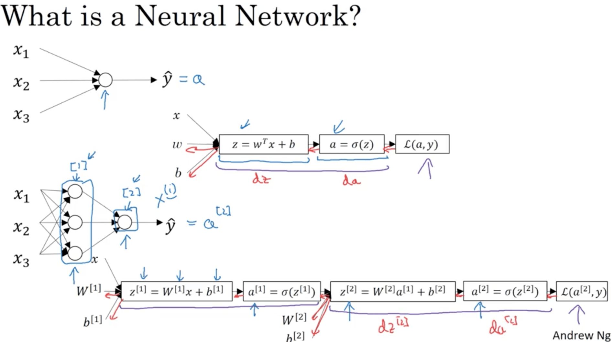

### Neural Network Representation
Let’s give the NN some names:


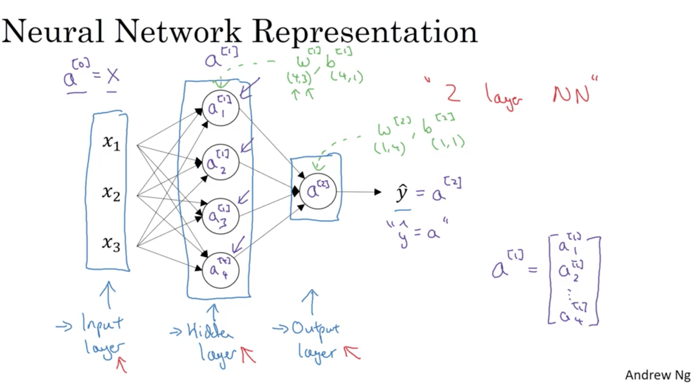


The hidden layer is called this way since we don’t see those values in the training set. “a”s are called activations.

### Computing a Neural Network's Output

As we said before, a single sigmoid neuron does two things: 
1. Compute $z = w^Tx + b$
2. Compute the sigmoid $\sigma(z)$

In a NN what we would do is have a hidden layer with a certain number of nodes. Each node is like a sigmoid neuron that outputs the so called “activation”, which we will call $a_i^{[l]}$, which means activation of the neuron $i$ in the layer $l$.

The following image shows this done for the first two nodes (or hidden units) in the first hidden layer. This is going to be repeated for each hidden unit. As before, this can be vectorized, putting the weights $w_1^{[1]}, w_2^{[1]} , w_3^{[1]}, w_4^{[1]}$ into a matrix called $W^{[1]}$.


The same thing will we done for the next layer (in this case the output layer), that since has a single node it’s going to be exactly like logistic regression. 

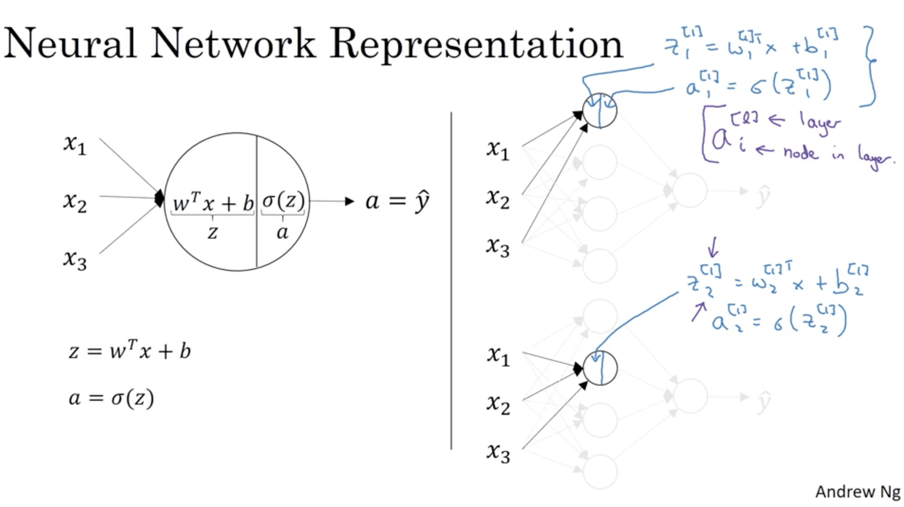

### Vectorizing across multiple examples
What we need to do is find a way to transform the vector of the x training examples $[x_1, \ldots, x_m]$ into the activations $ a^{[2]}, \ldots, a^{[2](m)} = \widehat{y}^{(m)}$.

A for loop implementation in pseudo code would be:

```
for i = 1 to m:
    z1i = w1xi + b1
    a1i = sigmoid(z1i)
    z2i = w2a1i + b2
    a2i = sigmoid(z2i)
```

Before we stacked the vectors x as vectors in a matrix X.
What we’ll do now is:

$$
\begin{align}
& Z^{[1]} = w^{[1]} X + b^{[1]} \\
& A^{[1]} = \sigma( b^{[1]} ) \\
& Z^{[2]} = w^{[2]} A^{[1]} + b^{[2]} \\
& A^{[2]} = \sigma( b^{[2]}) \\
\end{align}
$$ 

Z is the old vectors $w_1^{[2]}, \ldots $ stacked into a matrix. Same thing for A. One of the properties of this notation is that Z and A horizontally are indexed by the training examples, while vertically on the different nodes. For instance, a training set of 1000 examples and a hidden layer with 5 notes would give us a A and Z matrices of shape (5, 1000). Also the matrix X had m columns, with m the number of training examples, but on the rows it had the number of features.
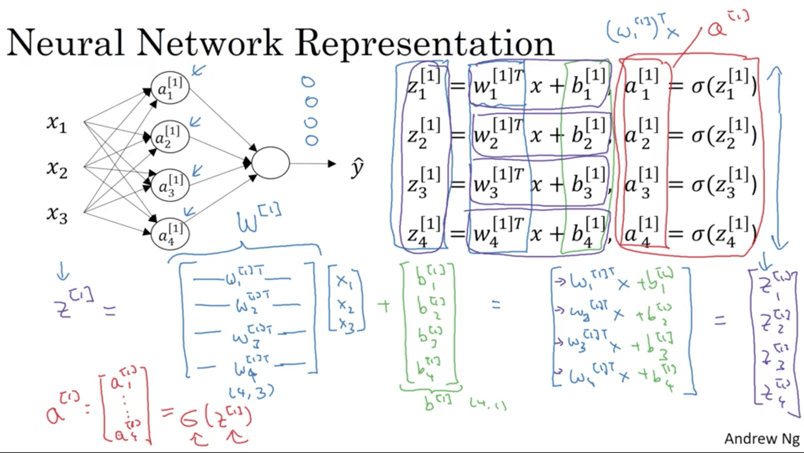

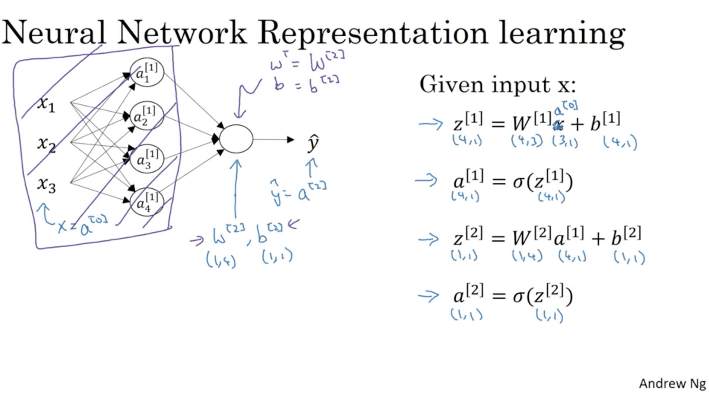

### Explanation for Vectorized Implementation
Let’s consider the propagation calculation of 3 training examples, assuming for simplicity that b = 0.

$$
\begin{align}
& Z^{[1](1)} = W^{[1]}x(1) \\
& Z^{[2](1)} = W^{[1]}x(2) \\
& Z^{[3](1)} = W^{[1]}x(3) \\
\end{align}
$$

Now $W^{[1]}$ is going to be a matrix, and $W^{[1]} x^{(1)}$, $W^{[2]} x^{(2)}$ and $W^{[3]} x^{(3)}$ all give as an output some column vectors. If we consider the training set X, formed by stacking together all the training examples vertically, when you multiply it for the matrix W, we would end up with columns made of the multiplication of the w column vectors for the x column vectors.

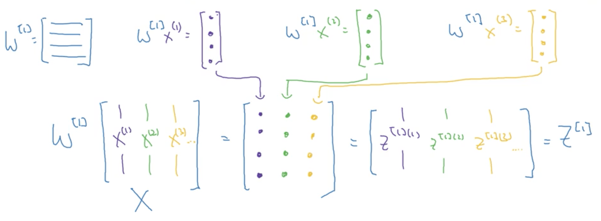

With python broadcasting, adding b would not create any problem, since it would be transformed into a vector and added to the column vectors we had before.

### Activation functions

So far we just used the sigmoid activation function, but there are better choices. In a general case, we can have any kind of non linear function $g(z^{[i]})$.

For instance, one that usually works better than the sigmoid function is the hyperbolic tangent function:

$$
a = \tanh(z) ) \frac{e \cdot z - e^{-z}}{e \cdot z + e^{-z}}
$$

This is basically a shifted version of the sigmoid function since has some sort of “centering” effect for the data. The main exception is for the output layer in case of a binary classification, which since it has to output either 0 or 1, the sigmoid function is the most used one.


Another popular choice is the REctified Linear Unit, ReLU. This function is:

$$
a = max(0, z)
$$

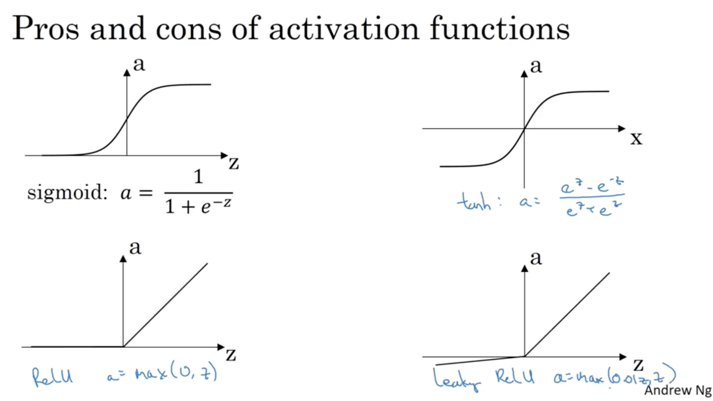

Some rules of thumb for choosing the activation function:
* If the output is binary (0, 1), a sigmoid is the natural choice.
* If you’re not sure what to use for the hidden layer just use a ReLU. Its disadvantage is that when $z < 0$ the gradient is zero, but it’s very fast.
* You may test also the tanh or leaky ReLU when using ReLU.

### Why do you need non-linear activation functions?
Let’s assume we don’t use an activation function at all (or a linear activation function). We’d just have:

$$
\begin{align}
& Z^{[1]} = w^{[1]} X + b^{[1]} \\
& A^{[1]} = Z^{[1]}  \\
& Z^{[2]} = w^{[2]} A^{[1]} + b^{[2]} \\
& A^{[2]} = Z^{[2]}  \\
\end{align}
$$

In this case we’d have:

$$
\begin{align}
& A^{[2]} = w^{[2]} ( w^{[1]} x + b^{[1]}) + b^{[2]} = \\
& (w^{[2]}w^{[1]} ) x + (w^{[1]} b^{[1]} + b^{[2]}) = w’x + b’\\
\end{align}
$$

The NN s therefore just outputting a linear activation function even if you have several layers (the composition of linear functions is a linear function). The model is therefore no more expressive than a logistic model with no hidden layers.

There is one case in which you may want to use on linear activation function, which is in the case of regression. Also in this case, this would be used just on the output layer.

### Derivatives of activation functions
Let’s take a look at how we can calculate the derivatives of this activation functions.

For the sigmoid function:
$$
\sigma (z) = \frac{1}{1+e^{-z}} \\
$$


\begin{align}
 \frac{d\sigma (z)}{d(z)}  & = \dfrac{1}{1 + e^{-z}\ } \cdot \dfrac{(1 + e^{-z}) - 1}{1 + e^{-z}}   \\
& = \sigma (z)\cdot (1-\sigma(z)) \\
& = a(1-a)\\
\end{align}

For the hyperbolic tangent:
$$
a = \tanh(z) \frac{e*z - e^{-z}}{e*z + e^{-z}}
$$

$$
\frac{d \tanh(z)}{d(z)} = 1 - (\tanh(z))^2 = 1-a^2
$$

For the ReLU function:
$$
g(z) = max(0, z) \\
$$

$$
g’(z)= 
\begin{cases}
0,  & \text{if $z<0$} \\
1, & \text{if $z>0$} \\
undefined, & \text{if $z=0$}
\end{cases}
$$

If $z = 0$ even though it’s not mathematically accurate, we’ll just say the derivative is zero.

For leaky ReLU:
$$
g(z) = max(0.01, z)
$$
$$
g’(z)=
\begin{cases}
0.01  & \text{if $z <0$} \\
1 & \text{if $z>0$}
\end{cases}
$$

### Gradient descent for Neural Networks
We have the following parameters:
* $w^{[1]}$
* $b^{[1]}$
* $w^{[2]}$
* $b^{[2]}$

The computational graph has three layers:
* Input layer, dimension $n_x = n^{[0]}$
* Hidden layer, dimension $n^{[1]}$
* Output layer, dimension $n^{[2]} = 1$

The cost function is:

$$
J( w^{[1]}, b^{[1]}, w^{[2]}, b^{[2]} ) = \frac{1}{m} \sum_{i=1}^{m} L (\widehat{y}, y)
$$

Each loop or gradient descent will:
1. Compute predictions
2. Compute the derivatives $(dw^{[1]}, db^{[1]}, \ldots) $
3. Update $w^{[1]} := w^{[1]}  - \alpha \cdot dw^{[1]}$ and same thing with $b^{[1]} , w^{[2]} and b^{[2]}$

Let’s now write the formulas for computing derivatives. The forward propagations steps are:


\begin{align}
& Z^{[1]} = W^{[1]}X + b^{[1]} \\
& A^{[1]} = g^{[1]} \\
& Z^{[2]} = W^{[2]}X + b^{[2]} \\
& A^{[2]} = g^{[2]} \\
\end{align}


The backpropagation will be:


\begin{align}
& dZ^{[1]} = A^{[2]} - Y \\
& dW^{[2]} = \frac{1}{m} dZ^{[2]}A^{[2]T} \\
& db^{[2]} = \frac{1}{m} \mathtt{np.sum(dZ^{[2]}, axis=1, keepdims=True) }\\
& dZ^{[2]} = W^{[2]T} dZ^{[2]} \times g^{[1]’} (Z^{[1]}) \\
& dW^{[1]} = \frac{1}{m} dZ^{[1]}X^T \\
& db^{[2]}.= \frac{1}{m} \mathtt{np.sum(dZ^{[1]}, axis=1, keepdims=True)} \\
\end{align}

Where `keepdims` is a numpy keyword to avoid having 1-rank arrays

### Random Initialisation
For NNs it’s crucial to initialise the weights randomly, while with logistic regression we could also initialise them with zeros.

Let’s see why. Let’s say we have a NN with 2-dimensional input and a hidden layer with two nodes. if the matrix of the weights has all zeros, $a^{[1]}_1 = a^{[2]}_2$. In this case we say that the two activation function are symmetric. For this reason, when we update the weights the matrix of the weights will always be all equals to each other, and they’re all be computing the same thing. Basically, you would have something that works exactly like if you had just one hidden unit, no matter how deep your NN is and for how long you train.

The solution to this is initialise the parameters randomly, for instance in this way:

```
w1 = np.random.randn((2, 2)) * 0.01
b1 = np.zeros((2, 1))
w2 = np.random.randn((1, 2)) * 0.01
b2 = 0
```

Notice that:
* It’s better to have small values for the weights, therefore we multiply the random values for 0.01. The reason is that if W is too large we would end up to have a saturated activation function in case of tanh or sigmoid functions, which slows down the convergence since gradients are very small for large values. The value of 0.01 is OK for small NNs, we’ll see later how to change it for deep NNs.
* for the biases it’s OK to be initialised with all zeros

## Week 4: Deep NNs
### Deep L-layer neural network
What is a deep NN? It’s a NN with many layers. We say that a logistic regression can be considered as a “shallow” neural network. For instance instead a 5 layer NN would be considered a deep NN.

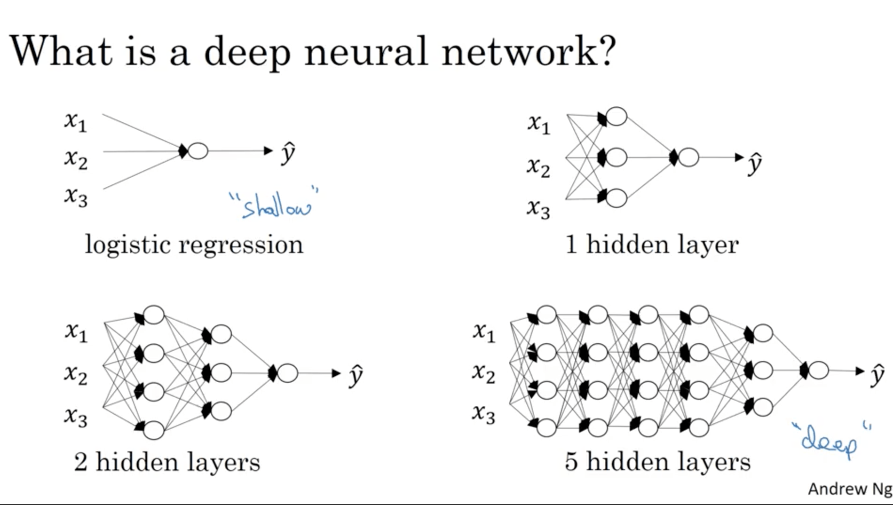

Notation:
* L is the number of layers in a NN
* $n^{[l]}$ is the number of nodes in layer l
* $a^{[l]}$ is the activation of layer l
* $w^{[l]}$ are the weights for layer l
* $a^{[l]}$ is the number of nodes in layer l

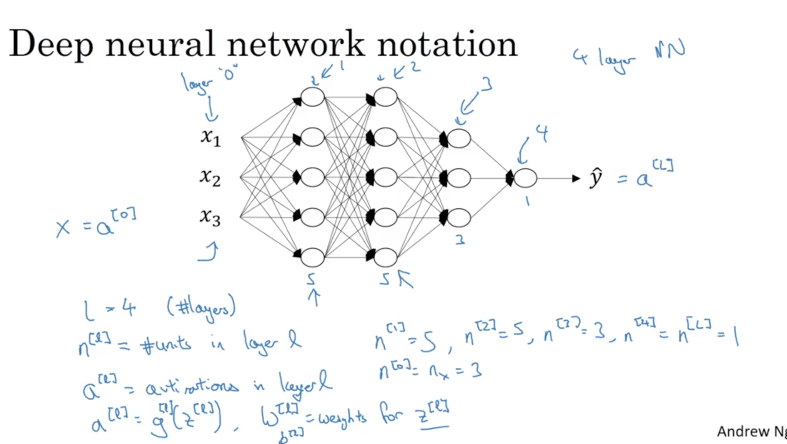


### Forward and Backward Propogation
Here’s what a forward propagation step does for layer l:
* Input  $a^{[l-1]}$
* Output  $a^{[l]}$
* Cache  $z^{[l]}$,  $w^{[l]}$,  $b^{[l]}$

The calculations it performed are (vectorized):
*  $Z^{[l]} =  W^{[l]} A^{[l-1]} + b^{[l]}$
*  $A^{[l]} =  g^{[l]} ( Z^{[l]})$

This is done for each layer, therefore we start from $A^{[0]}$ which is X, and go on.

Let’s look now at a back propagation step. What this step does is: 
* Input  $da^{[l]}$
* Output  $da^{[l-1]}$, $dW^{[l]}$, $db^{[l]}$

The calculations it performed are (vectorized):

\begin{align}
& dZ^{[l]} =  dA^{[l]} * g^{[l]’} ( Z^{[l]}) \\
& dW^{[l]} =  \frac{1}{m} dZ^{[l]} A^{[l-1]T}  \\
& db^{[l]} =  \frac{1}{m} \mathtt{np.sum(dZ^{[l]}, axis=1, keepdims=True)} \\
& dA^{[l-1]} = W^{[l]T} * dZ^{[l]}  \\
\end{align}

To sum up:
* We have a certain amount of layers with let’s say ReLU activation function
* In case of binary classification, we’ll have an output layer with sigmoid activation function
* The final output layer outputs the predictions, that we can use to compute the loss
* We go back calculating the derivatives in the backprop step


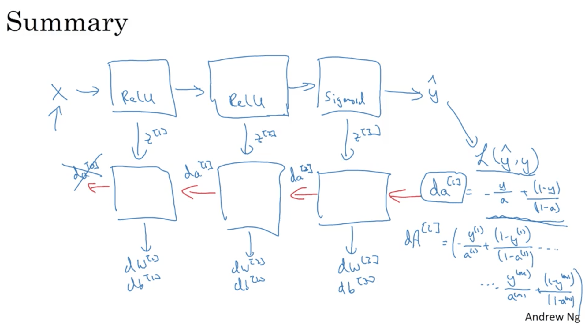

### Forward Propagation in a Deep Network
We previously listed the operations that are necessary to compute a step of forward propagation in a deep network. Let’s see how all the steps would look like for a 4 layers NN:

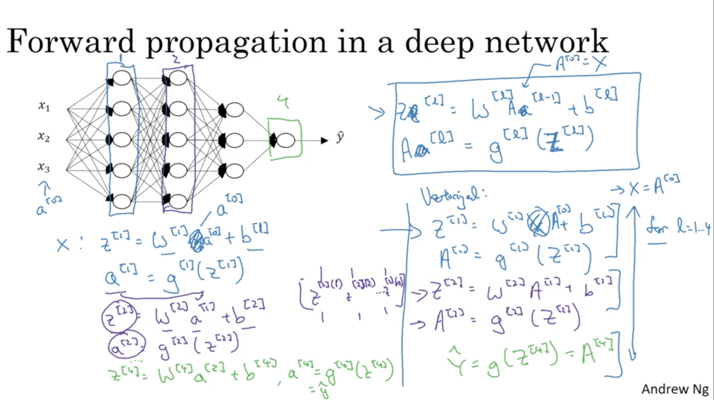

Notice how you have to implement a for loop to compute the activations for each layer of the NN.

### Getting your matrix dimensions right
When you add layers, it may happen to make mistakes in getting the matrix dimensions right.

Let’s consider a five layer NN. Let’s say that the number of hidden nodes are:
* $n^{[1]} = 3 $
* $n^{[2]} = 5 $
* $n^{[3]} = 4 $
* $n^{[4]} = 2 $
* $n^{[5]} = 1 $

The first operation we do to compute $z^{[1]} $ is $z^{[1]}  = w^{[1]}  x + b^{[1]}  $. In this case:
* since the number of hidden nodes is 3, the dimensions of z are going to ne (3, 1)
* x is a $n^{[1]}$ dimensional vector, so its dimensions are (2, 1).
* W needs to be a matrix that will be multiplied with a (2, 1) vector to have a (3, 1= vector, therefore it’s going to be a (3, 2) vector. The rule is therefore that W is a $(n^{[1]} , n^{[0]} $ matrix.
* Following the same procedure, $w^{[2]}$ is going to be a (5, 3) matrix, which is equal to $n^{[2]} , n^{[1]} ) $.
* Since $z^{[2]} = w^{[2]} a^{[1]}  + b^{[2]}  $, so basically the output of a multiplication between a (5, 3) and a (3, 1) matrices, its dimension are going to be (5, 1)
* $w^{[3]} $ is going to be (4, 5)
* $w^{[4]} $ is going to be (2, 4)
* $w^{[5]} $ is going to be (1, 2)
* Regarding the biases, they all need to have the same dimensions as Z

**General rules**:

\begin{align}
& w^{[l]} : (n^{[l]}, n^{[l-1]}) \\
& b^{[l]} : (n^{[l]}, 1) \\
& dw^{[l]}  = w^{[l]} : (n^{[l]]} , n^{[l-1]}) \\
& db^{[l]} = b^{[l]} : (n^{[l]} , 1) \\
\end{align}

For a vectorized implementation, the dimensions of W, b, dW and db will be the same but the dimensions of Z and A will change:

* The first operation we do to compute $Z^{[1]} $ is $Z^{[1]}  = W^{[1]}  X + b^{[1]}  $. In this case the dimension of X is $(n^{[0]}, m)$, therefore the dimensions of $Z^{[1]}$ are $(n^{[2]}, m)$ (it’s multiplied by $W^{[1]}$ which has dimensions $(n^{[1]} , n^{[0]} $.
* $b^{[1]}$ is still $(n^{[1]}, 1)$, but thanks to python broadcasting it will become $(n^{[1]}, m)$.

**General rules**:

\begin{align}
& Z^{[l]}, A^{[l]} : (n^{[l]]} , m) \\
& dZ^{[l]}, dA^{[l]} : (n^{[l]} , m)\\
\end{align}

### Why deep representations?
Let’s say that we want to build a NN to detect faces. What happens in a deep NN is that layers will start detecting different features with increasing complexity, for example:
* First layer learns to identify edges
* Second layer learns to identify eyes, noses, etc.
* Third layer learns to identify different kinds of faces

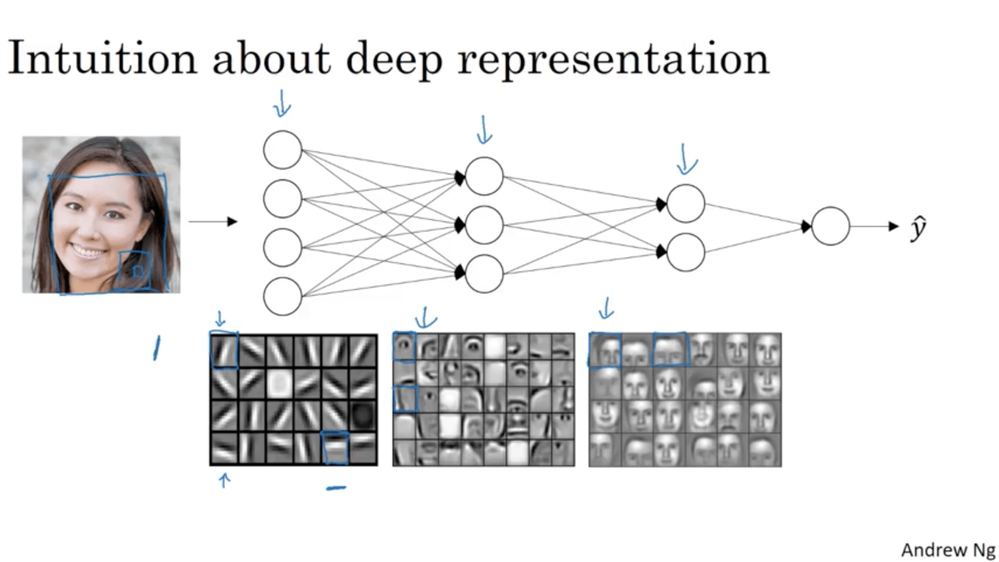

For sound it can work in a similar way, for example:
* First layer learns to identify if the sound is going up or down
* Second layer learns to identify phonemes
* Third layer learns to identify different words
* Fourth layer learns to identify different sentences

In a few words, it learns a _“simple to complex hierarchical representation”_.

Informally: there are functions you can compute with a “small” L-layer deep neural network that shallower networks require exponentially more hidden units to compute.

To demonstrate this, let’s say we want to compute the parity of a series of variables:

```
y = x1 XOR x2 XOR x3 ... XOR xn
```

With a deep network, the number of nodes would be $log(n)$, while with a single hidden layer it would become $2^{(n-1)}$.

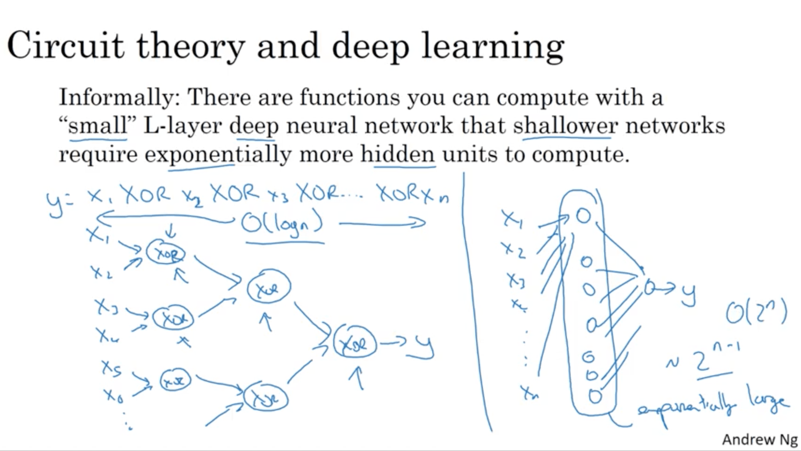


### Building blocks of deep neural networks
Generally, each layer of a NN can be seen as a block that:

* During Forward prop:
	* Has as an input $a^{[l-1]}$
	* Outputs $a^{[l]}$ using $w^{[l]}$ and $b^{[l]}$
	* Caches $z^{[l]}$ that is going to be used later
* During Back Prop:
	* Has as an input $da^{[l]}$
	* Outputs $da^{[l-1]}$ using $w^{[l]}$, $b^{[l]}$ and $dz^{[l]}$
	* Caches $dw^{[l]}$ and $db^{[l]}$ that is going to be used later

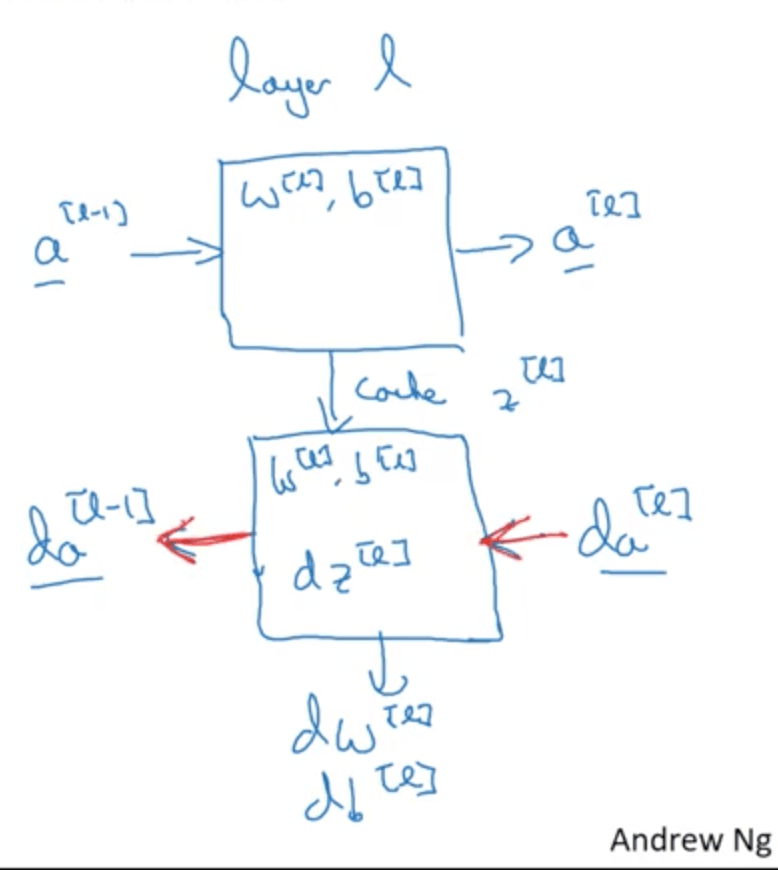

The whole computation will therefore be:

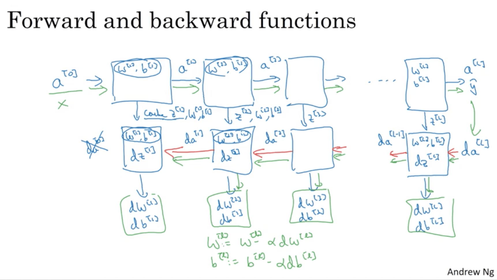

### Parameters vs Hyperparameters
The parameters of the algorithm are $W^{[1]}, b^{[1]}, W^{[2]}, b^{[2]} \ldots$

The hyperparameters are instead:
* Learning rate $\alpha$
* Number of iterations
* Number of hidden layers l
* Number of hidden units l
* Choice of activation functions

The reason why they’re called “hyperparameters” is because they affect the parameters we listed before. Those hyperparameters are chosen iteratively by making experiments and testing how the algorithm works. k 

### What does this have to do with the brain?
The analogy is done because the neurons in a NN look like a biological neuron, which receives electrical inputs, does something, and outputs other electrical stimuli.

However, we have no idea how exactly those neurons work, therefore the analogy is a little bit of a stretch…
